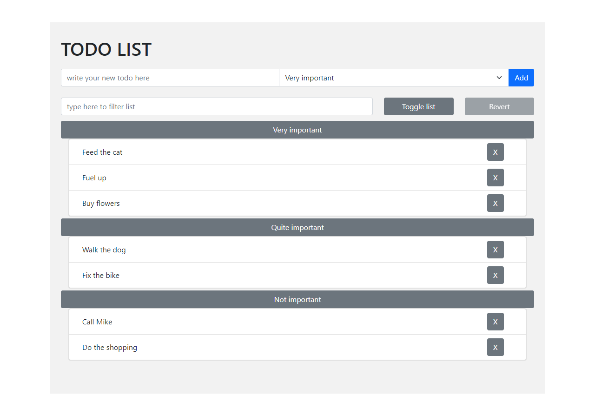

# TODO LIST

> Demo website with TODO list.

## Table of contents

- [TODO LIST](#todo-list)
  - [Table of contents](#table-of-contents)
  - [General info](#general-info)
  - [Demo](#demo)
  - [Screenshots](#screenshots)
  - [Technologies](#technologies)
  - [Setup and run](#setup-and-run)
  - [Features](#features)
  - [Issues](#issues)
  - [Status](#status)
  - [Contact](#contact)

## General info

This demo website was created as an exercise in basic JavaScipt DOM manipulations and Bootstrap styling.

## Demo

Project is avaible online on Github Pages [here](https://michaltkacz.github.io/todo-list/).

## Screenshots

|                User Interface                 |               Adding new TODO               |
| :-------------------------------------------: | :-----------------------------------------: |
|  |  |

|              Dynamic filtering              |               Delete / Revert               |
| :-----------------------------------------: | :-----------------------------------------: |
|  |  |

## Technologies

- HTML / CSS / JS
- [Bootstrap v5.0.0](https://getbootstrap.com/ 'Bootstrap page') front-end toolkit.
- [JQuery v3.6.0](https://jquery.com/ 'JQuery page') library.

## Setup and run

To run it locally, just download repository and launch `index.html` on local server.

## Features

List of features:

- Add new TODO.
- Select one of three categories.
- Dynamic list filitering, as you type.
- Show/hide choosen/all lists.
- Mark TODO as completed.
- Delete TODO.
- Revert last deleted TODO.

## Issues

Website is not fully mobile responsive.

## Status

This project is no longer developed.

## Contact

Created by [@michaltkacz](https://github.com/michaltkacz) - feel free to contact me!
